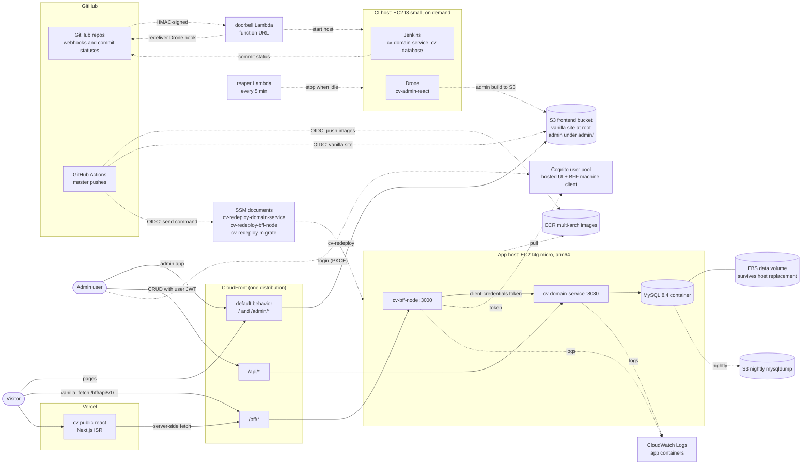

# Architecture Notes

See [README.md](../README.md) / [README.es.md](../README.es.md) for the full spec. This file describes the system **as deployed** (verified against the account and `cv-infra`'s Terraform on 2026-10-08, T-502) and the decisions behind it. Where something is design intent rather than deployed state, it says so.

## Repo topology

`cv-project` (this repo) is the **meta repo**: orchestration scripts, shared docs, and the global devcontainer. It holds no application code and no submodules. The eight product repos are ordinary siblings on disk, cloned via [`../clone-all.sh`](../clone-all.sh):

- `cv-database`
- `cv-domain-service`
- `cv-bff-node`
- `cv-admin-react`
- `cv-public-vanilla`
- `cv-public-react`
- `cv-observability`
- `cv-infra`

Each has its own git history, CI pipeline, issue tracker, and release cadence.

## Diagram

The deployed system (AWS eu-west-3 unless noted). Solid arrows are request paths; dashed arrows are deploy, CI and operations paths.



## Request flow

```
cv-public-vanilla ─┐                    /bff/*
cv-public-react   ─┴→ CloudFront ──────────────→ cv-bff-node → cv-domain-service → cv-database
cv-admin-react ─────→ CloudFront ──────────────→ cv-domain-service → cv-database
                                        /api/*
```

One CloudFront distribution serves `cv-public-vanilla` at its root, `cv-admin-react` under `/admin/` (both from S3, through a viewer function that routes the single-page apps), the BFF under `/bff/*` and the domain service under `/api/*`. `cv-public-react` runs on Vercel and calls the BFF through the same CloudFront domain, server-side only. Every path is live (T-501 verified the whole flow end to end on 2026-10-07).

The two edge prefixes are the routing contract (`docs/api-contract.md` § BFF, amended 2026-08-13 by T-013). `/bff/*` reaches the BFF on :3000; `/api/*` reaches the domain service on :8080. They are distinct because both services would otherwise claim `GET /api/v1/people/:id`. The prefix is carried through to the origin, not stripped, so the BFF serves `/bff/api/v1/...` in every environment.

`cv-admin-react` talks directly to `cv-domain-service`, bypassing the BFF, since the admin UI needs full CRUD rather than the aggregated, normalized shape the public sites consume. `cv-public-react` consumes the same BFF aggregate as `cv-public-vanilla`; it renders via ISR (60-second revalidation), so at runtime it only ever calls the BFF.

## Auth

- **Users:** Cognito issues JWTs through its hosted UI; `cv-admin-react` is the only interactive client (PKCE).
- **The BFF's public reads** (`GET /bff/api/v1/people/:id` and `.../cv`) are anonymous by an explicit two-route allowlist, even with `AUTH_ENABLED=true`. Every other BFF route needs a token. The contract explains why that is deliberate and what it puts at stake: on those routes, the BFF's normalization (no `id`, `personId`, `skillId`, `email` or `version`) is all that stands between the database and the open internet.
- **The BFF calls the domain service with its own Cognito client-credentials token** (scope `cv-domain/read`, 24-hour validity, cached; T-043/T-211).
- **The domain service accepts any token from the pool for reads, but writes require a user token** (scope `openid`), so the BFF's machine token is read-only (T-116).
- **Optimistic locking:** person, experience, education and project carry a `version`; a `PUT` with a stale one gets `409` (T-113, contract rule 8), and the admin handles it (T-303). Skill-catalog entries and person-skill assignments are **not** versioned, so concurrent skill edits are last-write-wins.
- **The edge is not an authenticator:** the origins don't verify that requests came through CloudFront. This is documented accepted risk with re-open triggers (T-025).

## Deploys

Every service deploys itself from `master`; no deploy credential lives on the CI host, with one exception (the admin's Drone key, below).

- **cv-domain-service and cv-bff-node:**
  1. A master push runs a GitHub Actions workflow. The domain service's first waits for Jenkins' green status on that commit.
  2. The workflow assumes the service's **master-only OIDC role**. That one role may push to the service's own ECR repository and send exactly one SSM document (`cv-redeploy-<service>`) to the app host, found by tag. It builds a multi-arch image on native amd64 and arm64 runners, pushes `:latest` and `:<sha>`, then sends the document. Because it can overwrite `:latest`, the master-only trust is what protects production.
  3. On the host, `cv-redeploy` pulls the image and resolves every input (SSM parameters, instance id) **before** removing the running container (T-055), then starts the new one with the same arguments the boot script uses (one shared definition in `/usr/local/lib/cv-app.sh`).
- **cv-database:** a master push that changes `sql/migrations/**` waits for Jenkins, then sends `cv-redeploy-migrate` (Flyway, migrations only, never the dev seeds) through its own OIDC role (T-049/T-158). **Schema first:** a migration merges and migrates before the domain change that needs it, because the domain service runs Hibernate with `ddl-auto: validate`.
- **cv-public-vanilla:** GitHub Actions with its own OIDC role syncs the build to the bucket root and invalidates CloudFront (T-403/T-045).
- **cv-admin-react:** Drone builds on the CI host and syncs `admin/` with a static IAM key kept in Drone, the one deploy credential on the CI host. It may write anywhere in the frontend bucket and create invalidations, nothing else (Drone runs cv-admin-react untrusted, T-005).
- **cv-public-react:** Vercel builds from `master`; the production build fails without a valid `BFF_URL` (T-404).
- **Images:** ECR keeps `:latest` plus the four previous `:<sha>` images per repo, and enough untagged per-arch children for all of them (T-050).
- **The app host itself** boots from a small hash-checked user_data stub that fetches the real provisioning script from S3 (T-044); the containers' run arguments live in that script. Any change to the rendered user_data replaces the host (`user_data_replace_on_change`): the stub, its inputs, or the script, whose hash the stub embeds. So does a deliberate `-replace`, for example for a new AMI. New images and migrations never do.

## CI on demand

The CI host (Jenkins and Drone behind Caddy with Let's Encrypt, at `ci.erfeamor.com`) runs only for builds:

- **Doorbell:** the repos' GitHub webhooks (every push and PR, not only master) hit a Lambda function URL. It verifies the HMAC signature and a repo allowlist, ignores events with nothing to build (branch deletions, non-build PR actions), and starts the host if needed (T-019/T-034/T-042). For **cv-admin-react only**, it then asks GitHub to redeliver Drone's own signed hook once the host is up. The Jenkins repos rely on Jenkins' scan on boot and every 5 minutes instead. A push while the host is already up is tagged `CILastPush` so the reaper waits for Jenkins' scan (T-048).
- **Reaper:** an EventBridge schedule runs a Lambda every 5 minutes that stops the host once Jenkins reports nothing queued or running **and** CloudWatch shows its CPU quiet for a 20-minute window (Drone can't be queried from a Lambda, so CPU stands in for its builds). It also waits out a 15-minute post-start grace and a 10-minute grace after the last push. Tag the host `CIKeepAlive` to pause it.
- **DNS:** the host has no Elastic IP. It updates `ci.erfeamor.com` to its new public IP on boot and sets the record to the `192.0.2.1` sentinel on shutdown (T-034/T-041).
- **Least privilege:** each host's role can read only its own SSM parameters (T-005). A Jenkins build is effectively root on the CI host, which is documented accepted risk.

## Data

MySQL 8.4 runs in a container on the app host (no RDS), with its data directory on a dedicated EBS volume that survives host replacement (T-018). A systemd timer dumps it nightly to a private S3 bucket (T-001). Production applies versioned migrations only; dev seeds stay local (`cv-database/sql/dev-seeds/`). Production holds the real CV as person 1 (T-503).

## Observability

Decided at [T-052](../.claude/tasks/T-052-observability-scope-decision.md) (2026-10-07):

- **Logs:** the domain service's and the BFF's container output ships to CloudWatch Logs (`/cv-project/cv-domain-service`, `/cv-project/cv-bff-node`, 14-day retention) through Docker's awslogs driver in non-blocking mode (T-054). Read it with `aws logs tail <group> --region eu-west-3`. MySQL's logs stay on the host. The CI Lambdas log to their own groups.
- **Metrics:** Prometheus and Grafana (`cv-observability`) run **only in the local dev stack, by design**. Nothing scrapes the deployed services, and the edge returns `403` for `/metrics`.
- **Not deployed:** structured JSON logging inside the apps and MongoDB Atlas (the README's original logging design).

## Infra and cost

Everything in AWS is Terraform in `cv-infra` (one root module, remote state in S3 with a DynamoDB lock). The account is on AWS's Paid plan; remaining credits pay first, then the card. Current figures live in one place each, and are not repeated here so they can't go stale: the meta repo's [CLAUDE.md](../CLAUDE.md) (cost bullet) and `cv-infra/CLAUDE.md` (cost model), measured by T-051. The endgame decision is T-012.
